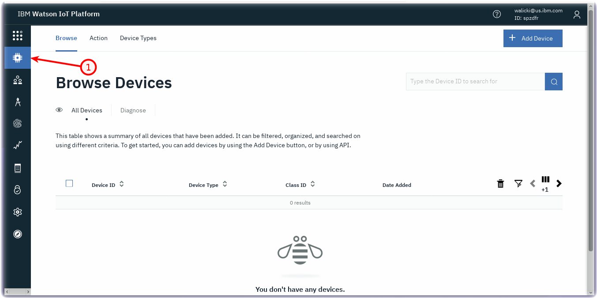
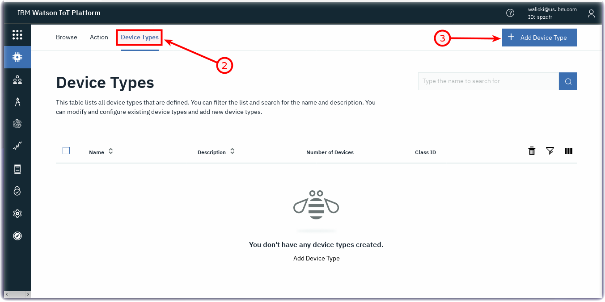
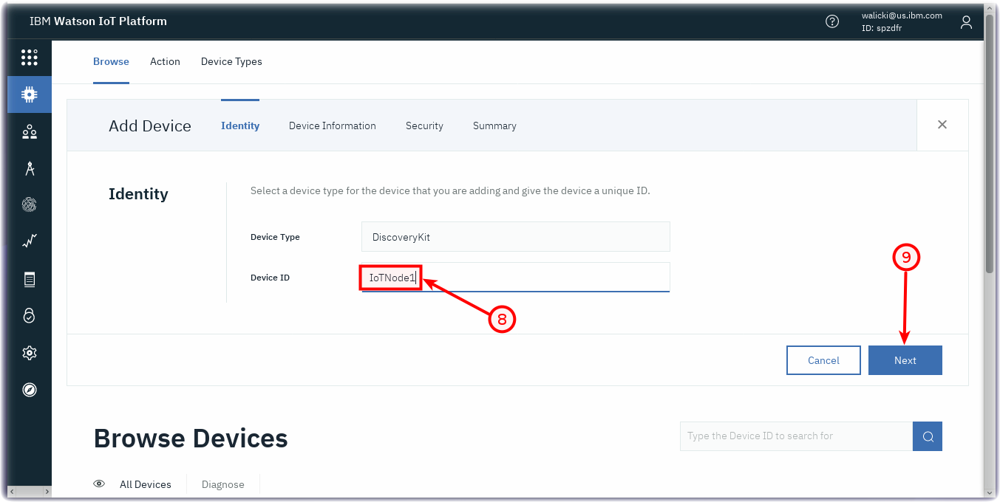
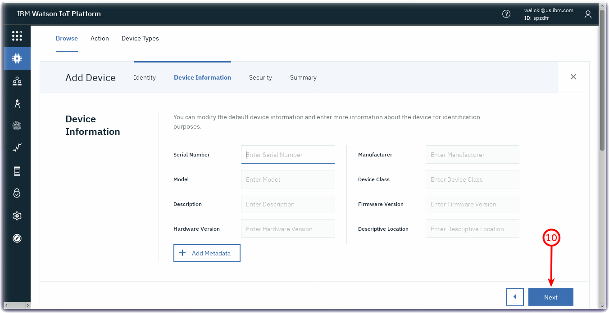
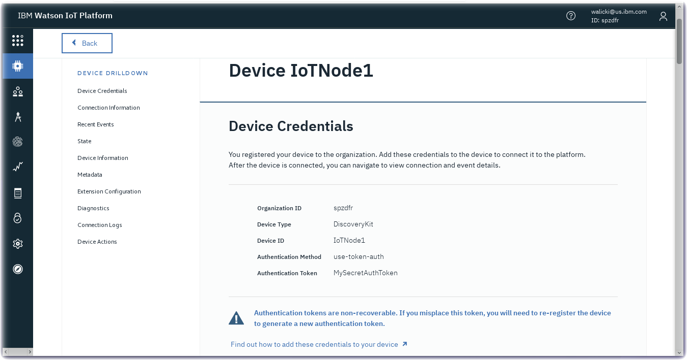

*Quick links :*
[Home](/README.md) - [Part 1](../part1/README.md) - [**Part 2**](../part2/README.md) - [Part 3](../part3/README.md) - [Part 4](../part4/README.md)
***
**Part 2** - [**Device Registration**](DEVICE.md) - [Application](APP.md) - [MQTT](MQTT.md) - [Server Certificate](CERT1.md) - [Client Certificate](CERT2.md)
***

# Registering a new device to the Watson IoT Platform

## Lab Objectives

This Lab will show you how to register your ST Micro Discovery Kit IoT Node with the IBM Watson Internet of Things Platform.  In the lab you will learn:

- How to define a device type and register a device in the IoT Platform

### Introduction

Before you can connect a device to the Watson IoT Platform you need to define how the device will connect to the platform and also register the device to generate an access token for the device.  This will be used to verify the device identity (we will come back to device authentication later in this part of the workshop).

You need to decide how you want to group devices, by function, by hardware type, etc.  Each device registered on the platform must be registered against a device type.  There are no restrictions about how devices are grouped and the device types, for this workshop we will create a device type representing the Discovery Kit devices.

### Step 1 - Add a new device type for Discovery Kit device

- Navigate into the Devices section (1) of the console

- Select the **Device Types** section (2).  Press the **+ Add Device Type** (3) button

- Enter the following:
 - Type : Ensure Device is selected (NOT Gateway)
 - Name : Enter **DiscoveryKit** (4)
- Press the **Next** button (5)

- Press the **Done** button (6)

### Step 2 - Register a new Discovery Kit device in the IoT Platform

You now have the opportunity to register a device.
- Press **Register Device** (7).

- The DiscoveryKit device type should be pre-selected.  You now need to enter a unique device ID.  You can choose how you want to identify devices.  For the workshop, use a simple format, such as **IoTNode1**. (8)
- Press **Next** button (9)

- Press **Next** button (10)

- You will be prompted to provide a token (11). When developing I recommend choosing a token you can easily remember.  I set all my devices to use the same token when developing, but obviously this is not a good production practice.

- Each time you connect the device the token will need to be presented to the server and once the device is registered there is no way to recover a token, you will need to delete and reregister the device if the token is lost.

- Enter a **token** for your device (11) then press **Next** (12).

- You will see a summary of the device.  Press **Done** to complete the device registration.

- You are now shown a **Device Credentials** page - this is the last chance you get to see the token.  Once you leave this page the token can not be recovered. Write down the Org, Device Type, Device ID and Authentication Token. You might even consider taking a screen shot.

***
**Part 2** - [**Device Registration**](DEVICE.md) - [Application](APP.md) - [MQTT](MQTT.md) - [Server Certificate](CERT1.md) - [Client Certificate](CERT2.md)
***
*Quick links :*
[Home](/README.md) - [Part 1](../part1/README.md) - [**Part 2**](../part2/README.md) - [Part 3](../part3/README.md) - [Part 4](../part4/README.md)
